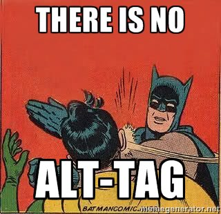

# Alt Tag Custom Element

If you ever had the pleasure to write some frontend code you have properly already heard of the famous "alt tag" for images in a discussion with other developers.
You should use it to explain the content of images for people with bad eye-sight. #a11y

Unfortunately, this tag does not exist in HTML despite the fact that it is referenced again and again by many highly professional experts.
For any reason the browser vendors still refuse to implement this tag.

It was time to fill this gap and implement it as a custom element!

## Usage

Include the script in your webpage and use the custom tag `x-alt` to set the alt attribute for an image. You can include the custom element where ever you want, for every image on the entire page.

```html
<!DOCTYPE html>
<html lang="en">

<head>
    <meta charset="UTF-8">
    <meta http-equiv="X-UA-Compatible" content="IE=edge">
    <meta name="viewport" content="width=device-width, initial-scale=1.0">
    <title>Document</title>
    <script src="dist/main.js"></script>
</head>

<body>
    
    <x-alt for="photo-1">A photo of the gizeh pyramides on a very sunny day</x-alt>
</body>

</html>
```

1. Set an id for the picture you want to enhance with the "alt tag".
2. Create the `x-alt` tag in you HTML code and reference the picture with the `for`-Attribute.
3. The alt tag's content text will be copied to the picture as its alt attribute.

## Build from the sources
We are using the [Parcel bundler](https://github.com/parcel-bundler/parcel) and [yarn](https://github.com/yarnpkg/yarn) to build the custom element.

In the root directory run the following steps to build the `dist/main.js` file from source.

```bash
yarn install
yarn build
```

## Real accessability

Of course this custom element is a small jest! It does not really add value to HTML at all.



If you are really interested in accessability, please refer to the [cheatsheet](https://moritzgiessmann.de/accessibility-cheatsheet/) by Moritz Giessmann.
